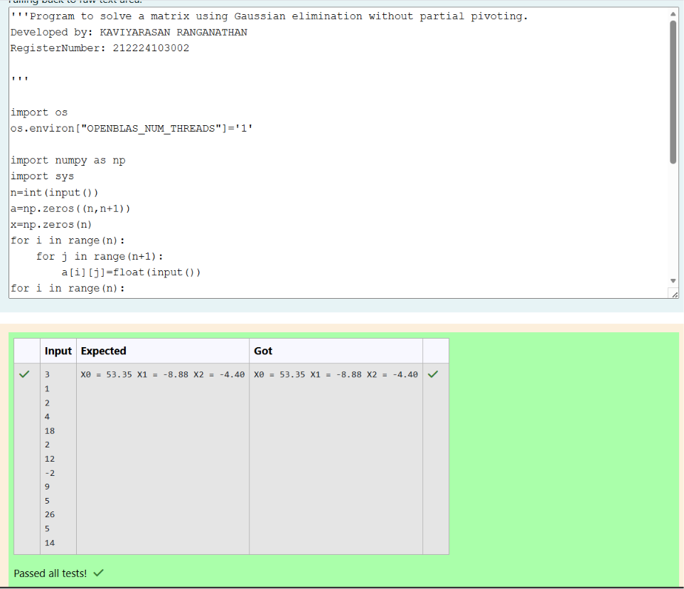

# Gaussian Elimination

## AIM:

To write a program to find the solution of a matrix using Gaussian Elimination.

## Equipments Required:

1. Hardware – PCs
2. Anaconda – Python 3.7 Installation / Moodle-Code Runner

## Algorithm

1. **Start** the program.
2. **Import Required Modules:**
   - Import `sys` for system-level exits (handling division by zero).
   - Import `numpy` as `np` for array allocation and matrix operations.
3. **Read Dimensions:**
   - Read the integer $n$ representing the number of unknowns (equations).
4. **Initialize Arrays:**
   - Create an augmented matrix $a$ of shape $(n, n+1)$ initialized with zeros.
   - Create a 1D array $x$ of size $n$ initialized with zeros to store the final solution vector.
5. **Input Elements:**
   - Read the entries of the augmented matrix row-by-row using nested loops for $i \in [0, n-1]$ and $j \in [0, n]$.
6. **Forward Elimination (Row Reduction):**
   - For each pivot row $i$ from $0$ to $n-1$:
     - Check if the diagonal pivot element $a[i][i] == 0.0$. If true, exit the program with message `"Divide by zero detected!"`.
     - For each subsequent row $j$ from $i+1$ to $n-1$:
       - Calculate the elimination factor:  
         $$\text{ratio} = \frac{a[j][i]}{a[i][i]}$$
       - For each column $k$ from $0$ to $n$:
         - Update: $a[j][k] = a[j][k] - \text{ratio} \times a[i][k]$
7. **Back Substitution:**
   - Compute the last variable directly:  
     $$x[n-1] = \frac{a[n-1][n]}{a[n-1][n-1]}$$
   - Loop $i$ backwards from $n-2$ down to $0$:
     - Set initial accumulator: $x[i] = a[i][n]$
     - For each already computed variable $j$ from $i+1$ to $n-1$:
       - Update: $x[i] = x[i] - a[i][j] \times x[j]$
     - Finalize variable value:  
       $$x[i] = \frac{x[i]}{a[i][i]}$$
8. **Display Result:**
   - Loop $i$ from $0$ to $n-1$ and print each variable formatted as `X{i} = {x[i]:0.2f} `.
9. **Stop** the program.

## Program:

```python
'''
Program to solve a matrix using Gaussian elimination without partial pivoting.
Developed by: KAVIYARASAN RANGANATHAN
RegisterNumber: 212224103002
'''

import os
os.environ["OPENBLAS_NUM_THREADS"]='1'

import numpy as np
import sys
n=int(input())
a=np.zeros((n,n+1))
x=np.zeros(n)
for i in range(n):
    for j in range(n+1):
        a[i][j]=float(input())
for i in range(n):
    if a[i][i]==0.0:
        sys.exit('Divide by zero detected!')
    for j in range(i+1,n):
        ratio = a[j][i]/a[i][i]
        for k in range(n+1):
            a[j][k]=a[j][k] -ratio * a[i][k]
x[n-1] = a[n-1][n]/a[n-1][n-1]
for i in range(n-2,-1,-1):
    x[i]=a[i][n]
    for j in range(i+1,n):
        x[i]=x[i]-a[i][j]*x[j]
    x[i]=x[i]/a[i][i]
for i in range(n):
    print("X%d = %0.2f " %(i,x[i]), end = "")
```

## Output:



## Result:

Thus the program to find the solution of a matrix using Gaussian Elimination is written and verified using python programming.
